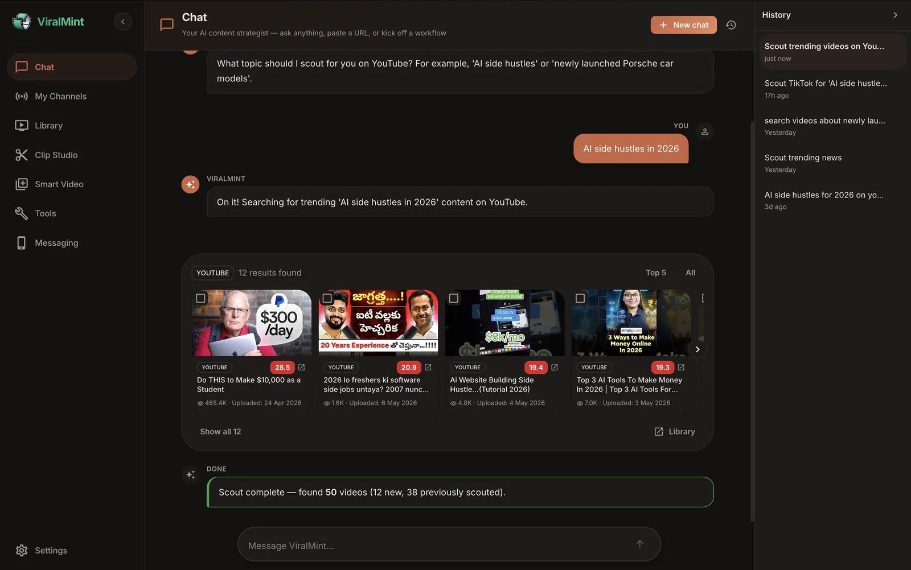
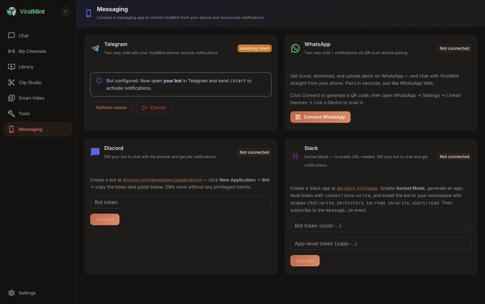
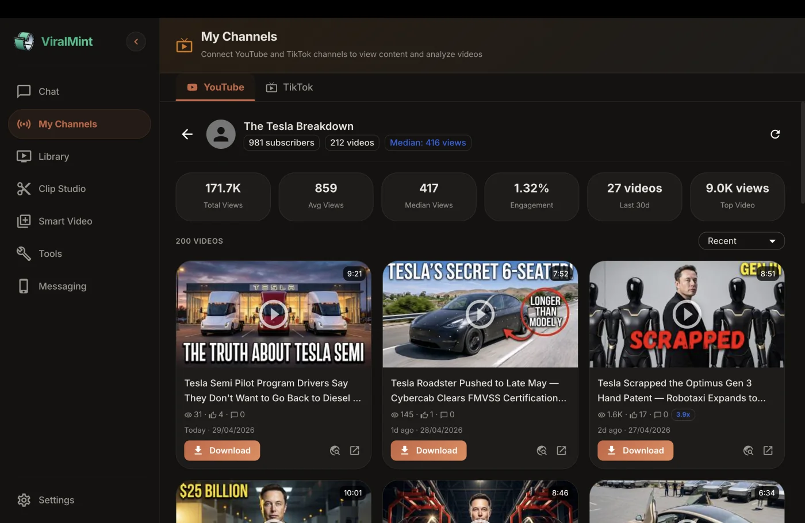
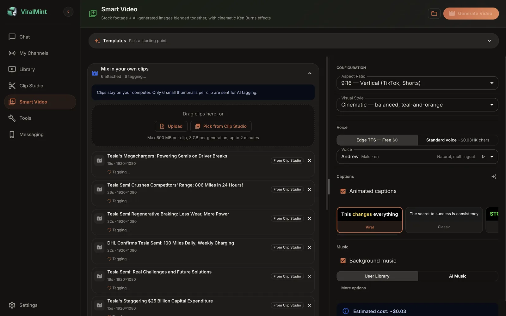
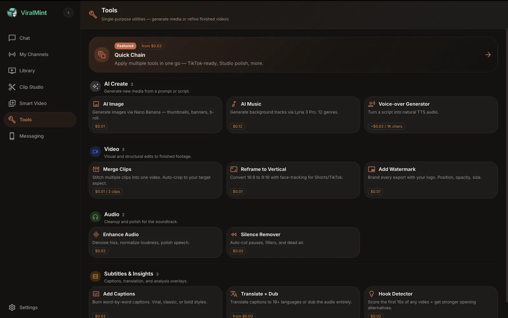

<div align="center">


# ViralMint

### The open-source viral content pipeline

**Scout trends → Analyze competitors → Generate videos → Auto-publish → Run anywhere from your phone.**
100% local. Bring your own API keys. No SaaS lock-in. No telemetry.

[🌐 Website](https://viralmint.net) • [Quick Start](#-quick-start) • [Features](#-features) • [Architecture](#-architecture) • [API Keys](#-bring-your-own-keys-byok) • [Contributing](CONTRIBUTING.md)

</div>

## 🚦 Two ways to use ViralMint

Same scout + analyze + generate engine. Different operational trade-offs. Pick the one that matches how you want to work.

<table>
<tr>
<td width="50%" valign="top">

### 🛠 Self-host (this repo)

**Your machine · BYOK · AGPL-3.0**

- ✅ Full pipeline including the **Uploader agent** that posts directly to YouTube + TikTok
- ✅ Phone-control via Telegram / WhatsApp / Discord / Slack
- ✅ 100% local — keys + scripts + videos never leave your machine
- ✅ Modify, fork, redistribute (AGPL-3.0)
- ⚠️ You manage the API keys, install, and updates

```bash
git clone https://github.com/openclaw-easy/ViralMint
cd ViralMint && python run.py
```

**[👉 Quick Start guide ↓](#-quick-start)**

</td>
<td width="50%" valign="top">

### ☁️ Hosted at [viralmint.net](https://viralmint.net)

**No install · prepaid credits · daily starter allowance**

- ✅ **Zero setup** — sign in and start
- ✅ No API keys to wire up — one bill, one dashboard
- ✅ Signed + notarized desktop installer (Mac / Win / Linux)
- ✅ Extras the OSS variant doesn't ship: **AI Music Studio**, **Visual Style preset**, **Translate-and-Dub**, polished **Tools** page
- ⚠️ No auto-upload (you download the mp4 and post manually)
- ⚠️ Closed-source SaaS

**[🚀 Try viralmint.net free →](https://viralmint.net)**

</td>
</tr>
</table>

The README below documents the **self-host** variant — keep reading if that's the path you want, or hop over to **[viralmint.net](https://viralmint.net)** for the hosted experience.

<div align="center">

<!-- Activity badges (top row) — these auto-update from GitHub, so they
     reflect real maintenance signal at a glance for awesome-list reviewers
     and new visitors. -->
[](https://github.com/openclaw-easy/ViralMint/stargazers)
[](https://github.com/openclaw-easy/ViralMint/commits/main)
[](https://github.com/openclaw-easy/ViralMint/releases)
[](https://github.com/openclaw-easy/ViralMint/actions/workflows/ci.yml)
[](LICENSE)

<!-- Stack badges (second row) — what the project is built on. -->
[](https://viralmint.net)
[](https://www.python.org/)
[](https://react.dev/)
[](https://fastapi.tiangolo.com/)
[](#-quick-start)

</div>

---

> **What manual creators do every day, ViralMint automates in one workflow.**
> Find trending videos across 5 platforms, transcribe and analyze them with local Whisper, write original scripts with AI, render stock-footage videos with word-by-word captions, and post directly to YouTube and TikTok — all from a single command. Talk to it from a browser, or chat with it on Telegram, WhatsApp, Discord, or Slack.

<p align="center">
  
  <br/>
  <sub><i>Chat with the AI agent: paste a URL, ask for a scout, or kick off a workflow — it runs the right pipeline in the background.</i></sub>
</p>

## ✨ Why ViralMint

|   |   |
|---|---|
| 🔒 **100% local** | SQLite, local Whisper, local FFmpeg. Your scripts, transcripts, downloads, and generated videos never leave your machine. |
| 🔑 **BYOK** | Bring your own Anthropic / OpenAI / OpenRouter / YouTube / Pexels keys. Encrypted at rest with AES-256. There is no ViralMint backend in the middle. |
| 📱 **Phone-first when you want it** | Two-way chat with the planner agent over Telegram, WhatsApp, Discord, or Slack. Get job notifications in the same thread. |
| 🤖 **Agent-based, not a chat wrapper** | Scout, Download, Analyzer, Generator, Uploader, and Planner — six purpose-built agents orchestrated by streaming AI chat. |
| 🆓 **Free out of the box** | Edge TTS (400+ voices), local Whisper, royalty-free music, Pexels stock — all the heavy stuff is free. Pay only for what you choose to upgrade. |
| 🪪 **AGPL-3.0** | Use it personally, build a business on it, fork it, modify it. The only ask: share your modifications under the same license if you distribute. |

---

## 🚀 Quick Start

### Prerequisites

| Tool | macOS | Linux | Windows |
|:-----|:-----|:------|:--------|
| **Python 3.11+** | `brew install python` | `apt install python3.11` | [python.org](https://www.python.org/downloads/) |
| **Node.js 18+** | `brew install node` | `apt install nodejs npm` | [nodejs.org](https://nodejs.org/) |
| **FFmpeg** | `brew install ffmpeg` | `apt install ffmpeg` | [ffmpeg.org](https://ffmpeg.org/download.html) |
| **ImageMagick** | `brew install imagemagick` | `apt install imagemagick` | [imagemagick.org](https://imagemagick.org/) |

### Install & Run

```bash
git clone https://github.com/openclaw-easy/ViralMint.git
cd ViralMint

python -m venv venv && source venv/bin/activate     # Windows: venv\Scripts\activate
pip install -r requirements.txt

cp .env.example .env                                  # optional — keys can also be set in the UI
python run.py
```

The first run installs frontend deps, builds the SPA, starts the API, and opens your browser at **http://localhost:16888**.

> 💡 **Don't have an API key yet?** Open Settings → AI Provider after launch and paste your Anthropic, OpenAI, or OpenRouter key directly into the UI. OpenRouter is a unified gateway — a single key gets you Claude, GPT, Gemini, Llama, and Mistral. Edge TTS, Whisper, FFmpeg, and yt-dlp work offline with zero configuration.

### Build a desktop `.app` from source (optional)

If you'd rather have a clickable `.app` than a terminal command, the repo includes a self-contained PyInstaller pipeline that produces a macOS `.dmg`, Linux `.tar.gz`, or Windows `.zip` of this OSS source — same code, no terminal needed at runtime.

```bash
PYTHON_BIN=./venv/bin/python VIRALMINT_VERSION=0.1.0-dev \
  bash desktop/scripts/build-app.sh
```

Output lands in `desktop/release/`. First build takes ~10–15 min (PyInstaller bundling is the long pole). Skip flags, signing/notarization env vars, and the smoke-test recipe live in **[`desktop/README.md`](desktop/README.md)**.

Note: this build is a **vanilla bundle of the OSS app** — your browser is the UI, no tray launcher, no auto-update, no signed binaries unless you provide a Developer ID. The richer desktop experience (Tools page, AI Music tab, Visual Style preset, signed-and-notarized installer) comes from the prebuilt [viralmint.net](https://viralmint.net) installer.

---

<div align="center">

### 🚀 Want the polish without the setup?

Try **[viralmint.net](https://viralmint.net)** — same scout + analyze + generate engine, hosted, no API keys to wire up. Sign up in 30 seconds, free daily allowance to evaluate, signed + notarized desktop installer + AI Music Studio + Visual Style preset + Translate-and-Dub included.

**[Try viralmint.net free →](https://viralmint.net)**

</div>

---

## 🎯 Features

<table>
<tr>
<td width="50%" valign="top">

### 🔍 Scout
Multi-platform trend discovery across **YouTube, TikTok, Douyin, and Google Trends** with AI virality scoring, view-velocity analysis, and outlier detection (3×–20× channel baseline).

</td>
<td width="50%" valign="top">

### 🧠 Analyze
Local Whisper transcription, AI insight extraction (hook, structure, tone, retention risks), segment-level scoring, and AI-generated improvement suggestions per video.

</td>
</tr>
<tr>
<td width="50%" valign="top">

### 🎬 Generate
Full pipeline: AI script → TTS voice → Pexels stock footage matched to keywords → word-by-word animated captions → background music → AI thumbnail.

</td>
<td width="50%" valign="top">

### ✂️ Clip Studio
Extract viral 30–60s shorts from long-form videos. AI picks the best moments and auto-burns captions. One source video → many publishable clips.

</td>
</tr>
<tr>
<td width="50%" valign="top">

### 📤 Publish
Direct upload to **YouTube** (OAuth) and **TikTok** (OAuth or session cookie) with platform-optimized titles, descriptions, tags, and thumbnails.

</td>
<td width="50%" valign="top">

### 💬 Chat
Streaming WebSocket chat that orchestrates every agent. Say *"scout cooking videos"* or *"download this URL"* and it just runs. Action blocks dispatch background jobs.

</td>
</tr>
<tr>
<td width="50%" valign="top">

### 📲 Messaging
Two-way chat from your phone via **Telegram, WhatsApp, Discord, Slack**. Get job alerts and command the planner from anywhere — same agent, different transport.

</td>
<td width="50%" valign="top">

### ⬇️ Universal Downloader
yt-dlp under the hood — supports YouTube, TikTok, Bilibili, Instagram, Twitter, SoundCloud, Vimeo, and 1000+ other sites.

</td>
</tr>
</table>

---

## 📸 Screenshots

<table>
<tr>
<td width="50%" align="center" valign="top">
  <a href="docs/screenshots/library.webp"></a>
  <sub><b>Library — Scout results</b><br/>154 videos discovered, sorted by AI virality score, downloadable in one click.</sub>
</td>
<td width="50%" align="center" valign="top">
  <a href="docs/screenshots/clip-studio.webp"></a>
  <sub><b>Clip Studio — viral clip extraction</b><br/>AI picks the best 30–60s moments from a long video, scores them, and burns captions automatically.</sub>
</td>
</tr>
<tr>
<td width="50%" align="center" valign="top">
  <a href="docs/screenshots/messaging.webp"></a>
  <sub><b>Messaging — chat from your phone</b><br/>Connect Telegram, WhatsApp, Discord, or Slack to control the planner agent and receive job notifications.</sub>
</td>
<td width="50%" align="center" valign="top">
  <a href="docs/screenshots/channel-analysis.webp"></a>
  <sub><b>My Channels — channel analytics</b><br/>Connect any YouTube/TikTok channel by URL. View counts, engagement, median views, and outlier detection.</sub>
</td>
</tr>
<tr>
<td width="50%" align="center" valign="top">
  <a href="docs/screenshots/smart-video.webp"></a>
  <sub><b>Smart Video studio</b> <i>(extras like the Visual Style preset and AI Music tab are exclusive to the <a href="https://viralmint.net">desktop installer</a>)</i><br/>Mix your own clips with stock footage; word-by-word captions; background music; cost estimator.</sub>
</td>
<td width="50%" align="center" valign="top">
  <a href="docs/screenshots/tools.webp"></a>
  <sub><b>Tools</b> <i>(bundled in the <a href="https://viralmint.net">desktop installer</a>)</i><br/>Quick Chain, AI Image, AI Music, Voice-over, Reframe, Watermark, Translate + Dub, Hook Detector — single-purpose utilities for finishing videos.</sub>
</td>
</tr>
</table>

---

## 🆓 What works without API keys

| Feature | Powered By | Cost |
|:--------|:-----------|:-----|
| Video downloading from 1000+ sites | yt-dlp | $0 |
| Audio transcription | Local faster-whisper | $0 |
| Voiceover (400+ voices, 70+ languages) | Edge TTS | $0 |
| Word-by-word animated captions | FFmpeg + ASS subtitles | $0 |
| Background music library | Royalty-free local library | $0 |
| Sound effects auto-placement | FFmpeg-synthesized | $0 |

YouTube/TikTok/Pexels still require free API keys — links in the next section.

---

## 🔑 Bring your own keys (BYOK)

Every key can be set in `.env` *or* per-user inside the app under Settings — whichever is set takes priority. Per-user keys are **AES-256 encrypted** before storage. Keys go straight to the provider; ViralMint has no backend server in the middle.

| For | Provider | Where | Cost |
|:----|:---------|:------|:-----|
| AI chat, scripting, analysis | **Anthropic** · **OpenAI** · **OpenRouter** | [console.anthropic.com](https://console.anthropic.com) · [platform.openai.com](https://platform.openai.com/api-keys) · [openrouter.ai/keys](https://openrouter.ai/keys) — Settings → AI Provider | Pay-per-use |
| YouTube scouting · comments · My Channels | YouTube Data API v3 | [console.cloud.google.com/apis/credentials](https://console.cloud.google.com/apis/credentials) — Settings → Service API Keys | Free 10K units/day |
| Stock footage | Pexels | [pexels.com/api](https://www.pexels.com/api/) | Free |
| Premium voiceover (optional) | OpenAI TTS | [platform.openai.com](https://platform.openai.com/api-keys) | Pay-per-use |
| TikTok / Douyin scouting | **TikHub API** (recommended) | [tikhub.io](https://tikhub.io) | Free tier |
| YouTube / TikTok upload | OAuth | One-click in Settings | Free |
| Telegram / Discord / Slack | Bot tokens | Settings → Messaging | Free |
| WhatsApp | QR-scan pairing | Settings → Messaging | Free |

> ⚠️ **TikTok / Douyin session-cookie scouting** is also available as an advanced fallback in Settings, but it violates the platforms' Terms of Service and the cookie's TikTok/Douyin account is the one TikTok/Douyin sees acting. **Use the TikHub API path unless you have specifically accepted that risk.** See [LEGAL.md](LEGAL.md#tiktok) for details.

---

## 🏗️ Architecture

```
                     ┌────────────────────────────────────────────────┐
                     │            React 18 + MUI 7 SPA                │
                     │       (served by FastAPI in production)        │
                     │  Chat · Channels · Library · Stock Video       │
                     │  Clip Studio · Messaging · Settings            │
                     └─────────────────┬──────────────────────────────┘
                                       │  HTTP + WebSocket
                                       ▼
                     ┌────────────────────────────────────────────────┐
                     │           FastAPI · localhost:16888            │
                     ├────────────────────────────────────────────────┤
                     │  Planner Agent ─── streaming chat + actions    │
                     │  Scout Agent ───── YouTube · TikTok · Douyin · │
                     │                    Google Trends               │
                     │  Download Agent ── yt-dlp (1000+ sites)        │
                     │  Analyzer Agent ── Whisper + AI insights       │
                     │  Generator Agent ─ Script → TTS → Stock →      │
                     │                    Captions → Music → MP4      │
                     │  Uploader Agent ── YouTube + TikTok OAuth      │
                     │  Messaging ─────── Telegram · WhatsApp ·       │
                     │                    Discord · Slack             │
                     └─────────────────┬──────────────────────────────┘
                                       │
              ┌────────────────────────┼─────────────────────────┐
              ▼                        ▼                         ▼
    ┌─────────────────┐    ┌──────────────────────┐    ┌──────────────────┐
    │  SQLite local   │    │  storage/ on disk    │    │  External APIs   │
    │  (encrypted     │    │  videos · audio ·    │    │  (BYOK, direct)  │
    │   credentials)  │    │  thumbnails · sfx    │    │                  │
    └─────────────────┘    └──────────────────────┘    └──────────────────┘
```

### Tech stack

| Layer | Stack |
|:------|:------|
| **Backend** | Python 3.11+ · FastAPI · SQLAlchemy 2.0 (async) · SQLite · WebSockets |
| **Frontend** | React 18 · Vite · MUI 7 · Zustand · React Router 6 |
| **AI (BYOK)** | Anthropic Claude SDK · OpenAI SDK · OpenRouter (300+ models via one key) |
| **Transcription** | faster-whisper (local, multilingual, GPU-aware) |
| **TTS** | Edge TTS (free) · OpenAI TTS |
| **Video** | Pexels stock · FFmpeg · Ken Burns image fallback |
| **Captions** | FFmpeg + ASS (word-by-word highlight animation) |
| **Download** | yt-dlp |
| **Messaging** | python-telegram-bot · discord.py · slack-sdk · neonize (WhatsApp) |
| **Security** | Fernet (AES-256) for credentials at rest |

---

## 📁 Project structure

```
ViralMint/
├── run.py                          # 🚀 Single entry point
├── launcher.py                     # System-tray launcher (optional)
│
├── backend/
│   ├── agents/                     # Planner, Scout, Download, Analyzer, Generator, Uploader
│   ├── api/                        # REST + WebSocket endpoints
│   ├── core/                       # AI client, BYOK key resolver, crypto, WebSocket manager
│   ├── messaging/                  # Telegram / WhatsApp / Discord / Slack channels
│   ├── models/                     # SQLAlchemy models
│   └── services/                   # TTS, video gen, captions, music, yt-dlp, Whisper, …
│
├── frontend/
│   └── src/
│       ├── pages/                  # Chat · Channels · Library · Stock Video · …
│       ├── components/             # Reusable UI (chat, settings, videos, …)
│       ├── hooks/                  # WebSocket, settings, jobs, source video
│       └── store/                  # Zustand global state
│
├── tests/                          # pytest test suite (92 tests)
├── storage/                        # Downloaded videos, audio, generated output (gitignored)
│
├── requirements.txt
├── .env.example
├── CONTRIBUTING.md
├── SECURITY.md
└── LICENSE                         # AGPL-3.0
```

---

## 🤝 Contributing

Pull requests welcome — bug fixes, new platforms, additional messaging channels, performance work, docs, anything. Read [CONTRIBUTING.md](CONTRIBUTING.md) for the workflow and house style, and review the [Code of Conduct](CODE_OF_CONDUCT.md) before opening your first issue.

- 📋 **Recent changes:** see [CHANGELOG.md](CHANGELOG.md)
- 🐛 **Report a bug:** [open an issue](https://github.com/openclaw-easy/ViralMint/issues/new?template=bug_report.md)
- 💡 **Request a feature:** [open an issue](https://github.com/openclaw-easy/ViralMint/issues/new?template=feature_request.md)
- 🔐 **Security vulnerability:** see [SECURITY.md](SECURITY.md) — **do not** file a public issue.

## 📜 License & terms of use

ViralMint is licensed under the **GNU Affero General Public License v3.0** ([LICENSE](LICENSE)).

In practice that means:

- ✅ Free for personal use, commercial use, modification, redistribution
- ✅ Run a SaaS on top of it
- ⚠️ If you distribute it (or run it as a public network service), you must share the modified source under the same AGPL-3.0 terms

**ViralMint is a tool you run on your own machine.** The maintainers don't host your content or proxy your API calls — every action is you, acting on your own platforms and keys. Read [LEGAL.md](LEGAL.md) before using the scouting and downloader features so you understand what's sanctioned (YouTube Data API, OAuth uploads, Pexels), what's at-your-own-risk (TikTok/Douyin session-cookie scouting), and what you're responsible for under each platform's Terms of Service.

---

<div align="center">

## ⭐ Star history

<a href="https://www.star-history.com/#openclaw-easy/ViralMint&Date">
  <picture>
    <source media="(prefers-color-scheme: dark)" srcset="https://api.star-history.com/svg?repos=openclaw-easy/ViralMint&type=Date&theme=dark" />
    <source media="(prefers-color-scheme: light)" srcset="https://api.star-history.com/svg?repos=openclaw-easy/ViralMint&type=Date" />
    
  </picture>
</a>

---

**Built with FastAPI, React, Whisper, FFmpeg, and a lot of async Python.**

</div>

<table align="center">
<tr>
<td width="50%" align="center" valign="top">

### ☁️ Prefer the hosted version?

No install, no API-key setup, free starter allowance.
**Signed + notarized desktop installer.**
AI Music Studio · Visual Style preset · Tools page included.

**[→ Try viralmint.net free](https://viralmint.net)**

</td>
<td width="50%" align="center" valign="top">

### ⭐ Helping this project?

The fastest way to help: hit the star button at the top.
Stars unlock awesome-list eligibility, attract contributors,
and signal to the world that this matters.

**[→ Star openclaw-easy/ViralMint](https://github.com/openclaw-easy/ViralMint)**

</td>
</tr>
</table>

<div align="center">

Project website: **[viralmint.net](https://viralmint.net)** · Source: **[github.com/openclaw-easy/ViralMint](https://github.com/openclaw-easy/ViralMint)** · License: **[AGPL-3.0](LICENSE)**

</div>
